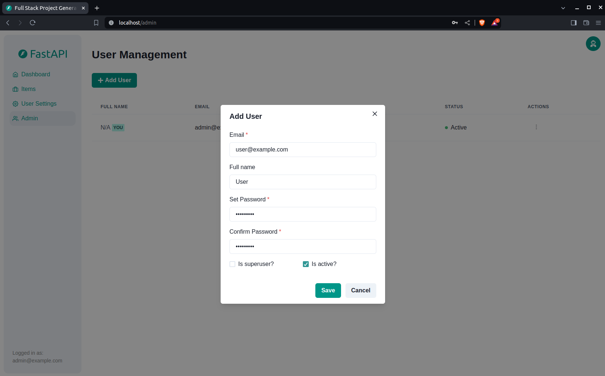
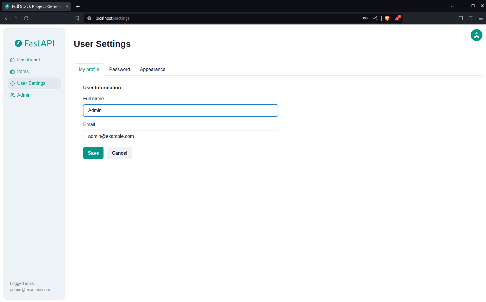

# AposentAI - Sistema de Inteligência Artificial para Previdência Social

> **Baseado no [Full Stack FastAPI Template](https://github.com/fastapi/full-stack-fastapi-template)**

[]()
[](https://github.com/Monterazo/AposentAI/issues)
[](https://github.com/Monterazo/AposentAI/pulls)
[](/LICENSE)

## 📋 Sobre o Projeto

O **AposentAI** é um sistema de Inteligência Artificial desenvolvido para otimizar processos na **Previdência Social brasileira**. Este projeto utiliza o Full Stack FastAPI Template como base tecnológica para fornecer uma aplicação web moderna e robusta.

### 🎯 Objetivos

- **Automatização da análise de documentos** da Previdência Social
- **Aceleração de concessões de benefícios** através de IA
- **Melhoria na gestão de processos judiciais**
- **Reforço no combate à fraude** com análise inteligente
- **Interface moderna e intuitiva** para servidores da Previdência

## 🏗️ Stack Tecnológica

Este projeto é baseado no **[Full Stack FastAPI Template](https://github.com/fastapi/full-stack-fastapi-template)** e utiliza:

### Backend
- ⚡ [**FastAPI**](https://fastapi.tiangolo.com) - Framework Python para APIs
- 🧰 [**SQLModel**](https://sqlmodel.tiangolo.com) - ORM para interações com banco de dados
- 🔍 [**Pydantic**](https://docs.pydantic.dev) - Validação de dados e gerenciamento de configurações
- 💾 [**PostgreSQL**](https://www.postgresql.org) - Banco de dados SQL

### Frontend
- 🚀 [**React**](https://react.dev) - Biblioteca JavaScript para interfaces
- 💃 **TypeScript** - Tipagem estática para JavaScript
- ⚡ [**Vite**](https://vitejs.dev) - Build tool moderna
- 🎨 [**Chakra UI**](https://chakra-ui.com) - Biblioteca de componentes
- 🤖 **Cliente frontend gerado automaticamente** a partir da API
- 🧪 [**Playwright**](https://playwright.dev) - Testes end-to-end
- 🦇 **Suporte a modo escuro**

### DevOps & Infraestrutura
- 🐋 [**Docker Compose**](https://www.docker.com) - Containerização
- 🔒 **Hash seguro de senhas** por padrão
- 🔑 **Autenticação JWT** (JSON Web Token)
- 📫 **Recuperação de senha por email**
- ✅ **Testes com [Pytest](https://pytest.org)**
- 📞 [**Traefik**](https://traefik.io) - Proxy reverso / load balancer
- 🚢 **Instruções de deploy** com Docker Compose
- 🏭 **CI/CD** baseado em GitHub Actions

> **Agradecimentos**: Este projeto utiliza como base o [Full Stack FastAPI Template](https://github.com/fastapi/full-stack-fastapi-template) desenvolvido pela comunidade FastAPI. Agradecemos aos contribuidores do template original por fornecerem uma base sólida e bem estruturada. Veja [CREDITS.md](./CREDITS.md) para mais detalhes sobre os créditos.

## 🖼️ Screenshots do Sistema

### Dashboard - Login
[](https://github.com/Monterazo/AposentAI)

### Dashboard - Administração
[](https://github.com/Monterazo/AposentAI)

### Dashboard - Criação de Usuário
[](https://github.com/Monterazo/AposentAI)

### Dashboard - Gestão de Itens
[](https://github.com/Monterazo/AposentAI)

### Dashboard - Configurações do Usuário
[](https://github.com/Monterazo/AposentAI)

### Dashboard - Modo Escuro
[](https://github.com/Monterazo/AposentAI)

### Documentação Interativa da API
[](https://github.com/Monterazo/AposentAI)

## 🚀 Como Usar

### Opção 1: Clone Direto

Você pode **simplesmente fazer fork ou clonar** este repositório e usar como está.

✨ Funciona imediatamente! ✨

### Opção 2: Usando Copier (Recomendado)

Este projeto suporta geração usando [Copier](https://copier.readthedocs.io):

```bash
# Instalar Copier
pip install copier

# Gerar novo projeto
copier copy https://github.com/Monterazo/AposentAI meu-projeto-aposentai --trust
```

### Configuração

1. **Clone o repositório**:
```bash
git clone https://github.com/Monterazo/AposentAI.git
cd AposentAI
```

2. **Configure as variáveis de ambiente**:
   - Copie `.env.example` para `.env`
   - Altere pelo menos:
     - `SECRET_KEY`
     - `FIRST_SUPERUSER_PASSWORD`
     - `POSTGRES_PASSWORD`

3. **Inicie com Docker Compose**:
```bash
docker compose up -d
```

4. **Acesse o sistema**:
   - Frontend: http://localhost:3000
   - API Docs: http://localhost:8000/docs
   - Adminer (DB): http://localhost:8080

## 🔧 Desenvolvimento

### Backend
Documentação do backend: [backend/README.md](./hooks/backend/README.md)

### Frontend  
Documentação do frontend: [frontend/README.md](./hooks/frontend/README.md)

### Deploy
Documentação de deploy: [deployment.md](./deployment.md)

### Desenvolvimento Geral
Documentação geral: [development.md](./development.md)

## 📝 Licença

Este projeto está licenciado sob a Licença MIT - veja o arquivo [LICENSE](LICENSE) para detalhes.

## 👥 Equipe

- **Lucas Monterazzo** (@Monterazo) - Machine Learning Engineer & Líder do Projeto
- **Anita Monteiro** - Full Stack Developer
- **Lucas Rodrigues** - UX/UI Designer & Frontend Developer

## 🤝 Contribuindo

Contribuições são sempre bem-vindas! Para colaborar:

1. Faça um fork do projeto
2. Crie uma branch: `git checkout -b minha-nova-feature`
3. Faça suas alterações
4. Commit: `git commit -m 'feat: nova funcionalidade'`
5. Push: `git push origin minha-nova-feature`
6. Abra um Pull Request

## 📊 Estado do Projeto

Este projeto está em **desenvolvimento ativo**. Novas funcionalidades, melhorias e correções são implementadas continuamente.

## 🔗 Links Úteis

- [Documentação FastAPI](https://fastapi.tiangolo.com)
- [Template Original](https://github.com/fastapi/full-stack-fastapi-template)
- [Issues do Projeto](https://github.com/Monterazo/AposentAI/issues)
- [Pull Requests](https://github.com/Monterazo/AposentAI/pulls)
