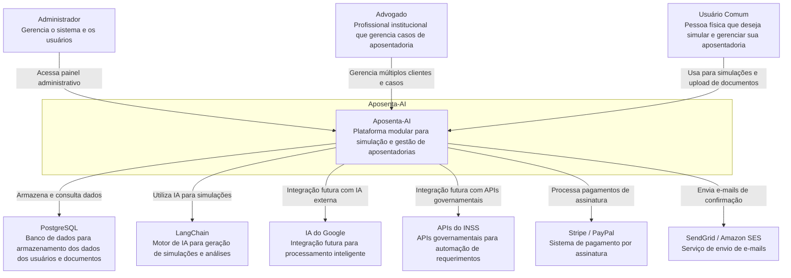
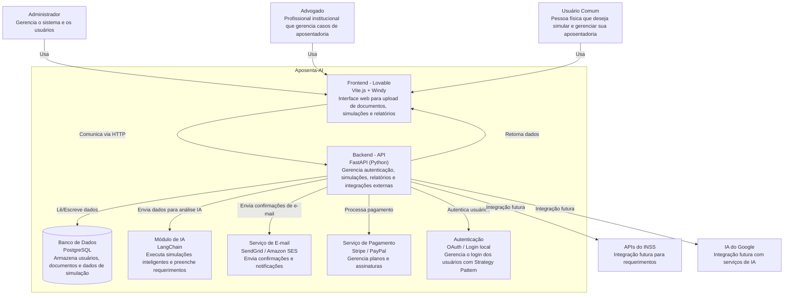
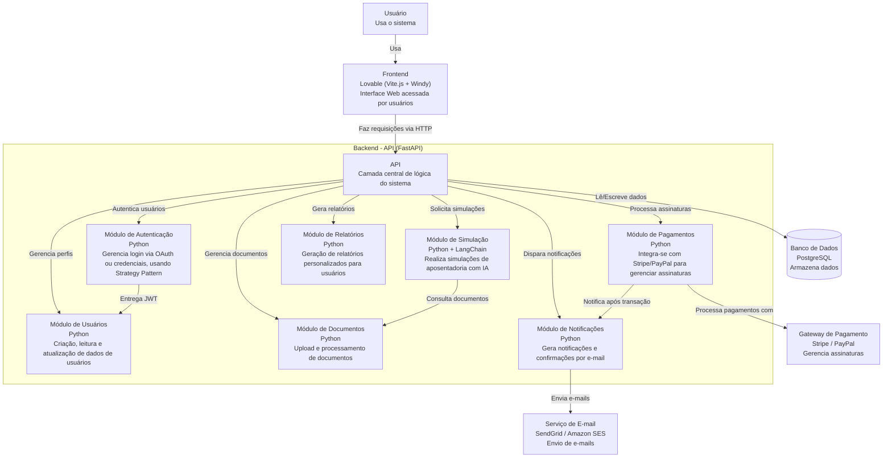
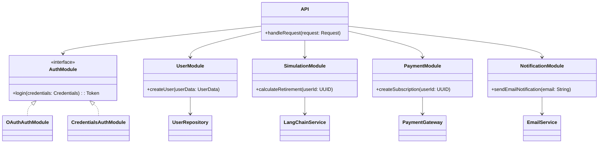

# Documentação da Arquitetura de Software: AposentAI

**Visão Geral**

Este documento descreve a arquitetura de software do sistema AposentAI utilizando o C4 Model. A arquitetura é apresentada em quatro níveis: Contexto, Container, Componente e Código, para fornecer uma visão clara e detalhada do sistema, desde a sua interação com o ambiente externo até a estrutura interna do código.

**Autores:** Anita Monteiro, Lucas Monterazo e Lucas Rodrigues  
**Data de Criação:** 30/07/2025

-----

## 1\. Diagrama de Contexto

### 1.1. Descrição do Diagrama de Contexto

O diagrama de contexto fornece uma visão geral de alto nível do sistema AposentAI e suas interações com os atores e sistemas externos. Ele mostra como os usuários interagem com o sistema e quais são as principais dependências externas necessárias para sua operação.

  - **Sistema:** Aposenta-AI
  - **Atores Externos:** Administrador, Advogado, Usuário Comum.
  - **Sistemas Externos:** IA do Google, APIs do INSS, Stripe / PayPal, SendGrid / Amazon SES, PostgreSQL, LangChain.

### 1.2. Diagrama

### 1.3. Descrição dos Componentes

  - **Atores Externos:**

      - **Administrador:** Um usuário com privilégios elevados que gerencia o sistema e as contas de outros usuários. Acessa o painel administrativo da plataforma.
      - **Advogado:** Um profissional ou entidade institucional que utiliza o sistema para gerenciar os casos de aposentadoria de múltiplos clientes.
      - **Usuário Comum:** Uma pessoa física que utiliza a plataforma para realizar simulações, fazer upload de documentos e gerenciar seu próprio processo de aposentadoria.

  - **Sistema:**

      - **Aposenta-AI:** O sistema central. Uma plataforma modular projetada para a simulação e gestão completa de processos de aposentadoria.

  - **Sistemas Externos:**

      - **IA do Google:** Uma integração futura planejada para processamento inteligente de dados e documentos.
      - **APIs do INSS:** Integração futura planejada para automatizar requerimentos e consultar dados diretamente das fontes governamentais.
      - **Stripe / PayPal:** Sistema de pagamento externo utilizado para processar as assinaturas dos usuários na plataforma.
      - **SendGrid / Amazon SES:** Serviço externo responsável pelo envio de e-mails transacionais.
      - **PostgreSQL:** O banco de dados principal, usado para armazenar e consultar todos os dados da aplicação.
      - **LangChain:** O motor de Inteligência Artificial que alimenta as funcionalidades de simulação e análise.

-----

## 2\. Diagrama de Container

### 2.1. Descrição do Diagrama de Container

O diagrama de container mostra os principais blocos de software que compõem o sistema Aposenta-AI e como eles interagem entre si. Ele expõe a arquitetura de alto nível da aplicação, detalhando as responsabilidades de cada parte.

### 2.2. Diagrama

### 2.3. Descrição dos Containers

  - **Frontend - Lovable (Vite.js + Windy):** Fornece a interface web para todos os usuários. É responsável por renderizar telas, capturar entradas e apresentar as simulações e relatórios.
  - **Backend - API (FastAPI - Python):** Cérebro do sistema. Gerencia toda a lógica de negócio, autenticação, orquestração de simulações e integração com outros containers.
  - **Banco de Dados (PostgreSQL):** Armazena de forma persistente todos os dados da aplicação, como usuários, documentos e simulações.
  - **Módulo de IA (LangChain):** Executa as simulações inteligentes de aposentadoria e o preenchimento automático de requerimentos.
  - **Serviço de E-mail (SendGrid / Amazon SES):** Envia e-mails transacionais para os usuários (confirmações, notificações).
  - **Serviço de Pagamento (Stripe / PayPal):** Gerencia os planos de assinatura e processa pagamentos.
  - **Autenticação (OAuth / Login local):** Gerencia o ciclo de vida da autenticação dos usuários, suportando múltiplos provedores.

-----

## 3\. Diagrama de Componente

### 3.1. Descrição do Diagrama de Componente

Este diagrama detalha a arquitetura interna do container **Backend - API**, mostrando os principais módulos que o compõem, suas responsabilidades e como interagem.

### 3.2. Diagrama

### 3.3. Descrição dos Componentes (Dentro da API)

  - **Módulo de Autenticação:** Gerencia o login (OAuth/credenciais) com o padrão Strategy.
  - **Módulo de Usuários:** Lida com o CRUD de dados dos usuários.
  - **Módulo de Documentos:** Gerencia upload, armazenamento e processamento de documentos.
  - **Módulo de Simulação:** Realiza simulações de aposentadoria usando LangChain.
  - **Módulo de Pagamentos:** Integra-se com o gateway de pagamento para gerenciar assinaturas.
  - **Módulo de Notificações:** Orquestra o envio de notificações e e-mails.
  - **Módulo de Relatórios:** Gera relatórios personalizados para os usuários.

-----

## 4\. Diagrama de Código (Opcional)

### 4.1. Descrição do Diagrama de Código

Este diagrama de classes ilustra as principais entidades de código, suas responsabilidades e os padrões de design aplicados para garantir uma arquitetura robusta e manutenível.

### 4.2. Diagrama

### 4.3. Descrição do Código

A arquitetura do código é modular, com cada funcionalidade encapsulada. Os principais padrões são:

  - **Padrão Strategy:** Utilizado no `AuthModule` para lidar com diferentes métodos de login (OAuth e credenciais).
  - **Padrão Repository:** Aplicado para abstrair a camada de persistência de dados (`UserRepository`, `DocumentRepository`).
  - **Fachada (Facade):** A classe `API` atua como uma fachada, recebendo requisições e delegando a responsabilidade para o módulo apropriado.
  - **Injeção de Dependência:** Módulos interagem com serviços externos (`LangChainService`, `PaymentGateway`, `EmailService`) através de interfaces bem definidas.

-----

## 5\. Decisões Arquiteturais

### 5.1. Decisões Importantes

*(Esta seção deve ser preenchida pela equipe com as principais decisões arquiteturais do projeto, suas justificativas e impactos. Exemplos: escolha do FastAPI, uso de LangChain, arquitetura modular, etc.)*

  - **Decisão:** [Nome ou breve descrição da decisão]
      - **Descrição:** [Detalhes sobre a decisão]
      - **Justificativa:** [Motivo pelo qual a decisão foi tomada]
      - **Impacto:** [Impacto da decisão no sistema]

-----

## 6\. Considerações Finais

### 6.1. Padrões e Práticas

*(Esta seção deve ser preenchida com os padrões e práticas adotados pela equipe.)*

  - **Padrões:** [Ex: MVC, CQRS, Strategy Pattern, Event-Driven Architecture]
  - **Práticas:** [Ex: Continuous Integration, Code Review, Testes Automatizados (TDD/BDD)]

### 6.2. Próximos Passos

*(Esta seção deve indicar melhorias futuras ou áreas a serem exploradas para a evolução da arquitetura.)*

  - [Ex: Implementar cache distribuído com Redis, Adotar um novo serviço de IA para análise de documentos.]